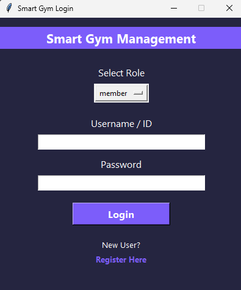
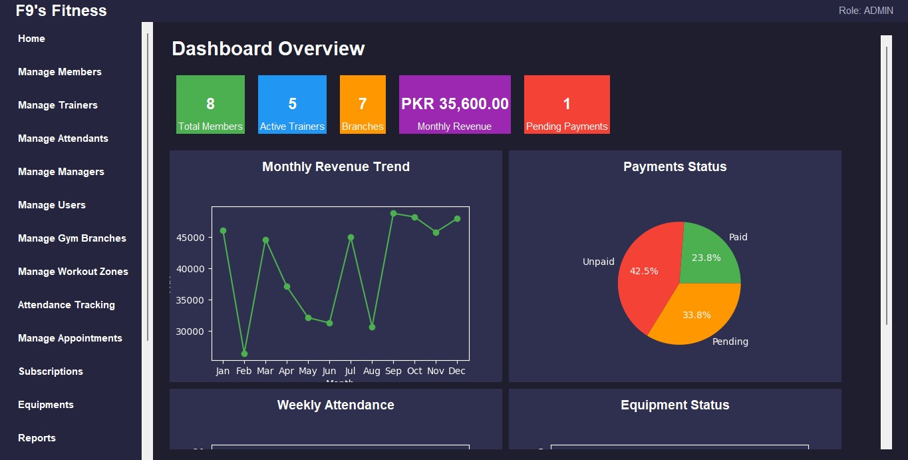
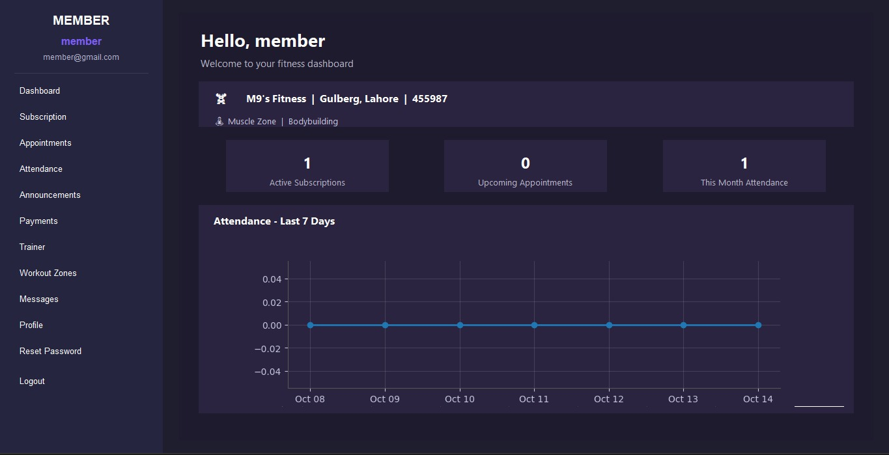
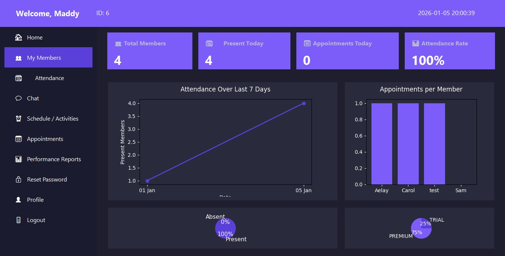
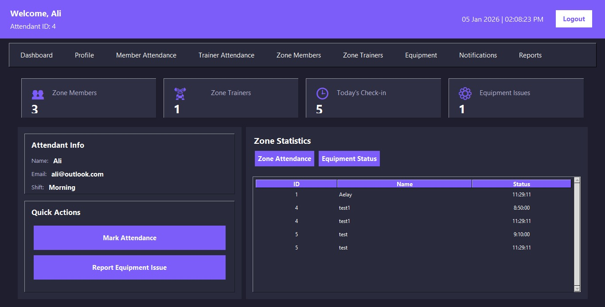
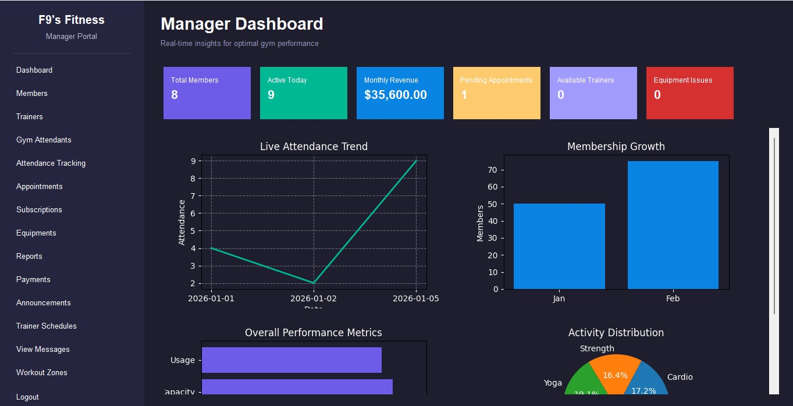

# 🏋️ Smart Gym Management System

The **Smart Gym Management System** is a desktop based application developed to simplify and automate the daily operations of a gym. The system helps gym management efficiently handle members, trainers, payments, attendance, and reports.

This project was developed as my **Final Year Project for BS Software Engineering**.

---

## 📌 Project Overview

Managing gym records manually can be time consuming and prone to errors. This system provides a **digital solution** that allows gym administrators to manage all operations in one place.

The application is designed for **M9's Fitness Gym** to streamline member management, appointment scheduling, and financial tracking.

---

## 🚀 Features

- 👤 **Member Management**
  - Add, update, and remove gym members
  - Store member details and membership plans

- 🧑‍🏫 **Trainer Management**
  - Assign trainers to members
  - Manage trainer details

- 📅 **Appointment Scheduling**
  - Schedule training sessions
  - Manage trainer availability

- 💰 **Payment Management**
  - Track membership payments
  - Maintain payment records

- 📊 **Attendance Tracking**
  - Monitor member attendance
  - Maintain daily attendance logs

- 📑 **Reports**
  - Generate reports for members, payments, and attendance

---

## 🛠️ Technologies Used

- Python  
- Tkinter / PyQt (GUI Development)  
- MySQL (Database)  
- SQL Queries  

---


## 📷 Application Screenshots

### Login Page


### Admin Dashboard


### Member Dashboard


### Trainer Dashboard


### Attendant Dashboard


### Manager Dashboard


---

## ⚙️ Installation Guide

### 1️⃣ Clone the repository

```bash
git clone: https://github.com/codingwithriha/FYP-Smart-Gym-Management.git
```

### 2️⃣ Navigate to the project folder

```bash
cd smart-gym-management-system
```

### 3️⃣ Install required dependencies

```bash
pip install -r requirements.txt
```

### 4️⃣ Configure the MySQL database

Set up your MySQL database and update the database configuration in the project files.

### 5️⃣ Run the application

```bash
python auth.py
```

---

## 🎯 Project Objective

The objective of this system is to **automate gym management operations**, reduce manual workload, and provide a **simple and efficient system** for managing members, trainers, and financial records.

---

## 👩‍💻 Author

**Riha Shahzadi**  
BS Software Engineering

---

## 📜 License

This project is developed for **educational purposes**.
